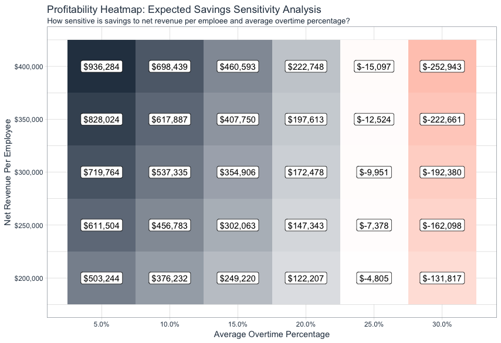

# Employee Attrition Analysis

## A. Goal

The goals of this post is to predict the probability of attrition for each employee and extract some business insights from the data such as calculating ROI and Gain & Lift, generating recommendations etc.  
## B. Data
 
The Data has 1350 rows and 35 features (including target) which could be downloaded from [here](https://www.ibm.com/communities/analytics/watson-analytics-blog/hr-employee-attrition/). 

## C. Why is this imporatnt?

> **"You take away our top 20 emplyees and we becomde a mediocre company"**  - Bill Gates

Employee turnover is a huge problem becasue employee is organizations' most valualbe resources. That's begin with the employee value overtime.


[source](https://www.linkedin.com/pulse/20130816200159-131079-employee-retention-now-a-big-issue-why-the-tide-has-turned/)

What this chart shows us is that as time continues, the organization's value increases while the emplyee become even more productive member. Let's simplify the plots and see what happen if an emplyee leaves.


[source: Business Science University](https://www.business-science.io/)

We can clearly find that as an employee leaves, organizations have to go through a period of hiring process, training process etc. In this period, the productivity is lost. Usually, some of the cost of attrition is hidden. It is hard to measure. Next, we will define how to calculate the cost.

**Cost Calculation**  
- Direct Costs
- Productivity Costs (Hidden Costs)
- Salary + Benefits

**1. Direct Costs**

| Item | Values |
| --- | --- |
| 1. Average Separation | $500 | 
| 2. Average Vacancy (Temporary Help, Overtime ...) | $10,000 | 
| 3. Average Aquasition (Ads, Travel, Interview ...) | $4,900 | 
| 4. Average Placement (New supplies, Training ...) | $3,500 | 
| Total (1. + 2. + 3. + 4.)| $18,900 |

**2. Productivity Costs (Hidden Costs)**

| Item | Values |
| --- | --- |
| 1. Annual Revenue Per Employee | $250,000 | 
| 2. Workdays Per Year | 240 | 
| 3. Average Workdays Position Is Open | 40 | 
| 4. Average Onboarding / Training Period | 60 | 
| 5. Effectiveness During Onboarding / Training | 50% |
| Total (1. / 2. x (3. + 4. x 5.))| $72,917 |

**3. Savings of Salary + Benefits**

| Item | Values |
| --- | --- |
| 1. Average Salary + Benefits | $80,000 | 
| 2. Workdays Per Year | 240 | 
| 3. Average Workdays Position Is Open | 40 | 
| Total (1. / 2. x 3.)| $13,333 |

Therefore, the **Estimated Attrition Cost Per Employee** would be **$78.483**  
If 200 employees turnover, it would cost the company **$15.7M Per Year**.


## D. Data Understaninf & Preparation

First, we can use histogram plot to check the distribution of our predictors. From the below plot, we can notice that,
- There are some zero-variance predictors which will be deleted later (Employee Count, Over 18, Standard Hours). 
- Some categorical predictors were misclassified as numerical features (JobLevel, StockOptionLevel)
- Highly skew predictors (threshold was set as 0.8)


Second, we scale and center the predictors. In general scaling the data would not hurt the model performance. Also, some of the algorithms would benefit a lot by scaling, such as KMeans, SVM, Deep Learning ... Third, we convert the categorical predictors into dummy variables since most of the algorithms need continuous inputs.

These problem can be solved by the R package `recipe`, then we plot the histogram again (Not include the dummy variables).

```
# Load the data

train_raw_tbl       <- read_excel(path_train, sheet = 1)
test_raw_tbl        <- read_excel(path_test, sheet = 1)
definitions_raw_tbl <- read_excel(path_data_definitions, sheet = 1, col_names = FALSE)

# Some Preprcessing

source("00_Scripts/data_processing_pipeline.R")
train_readable_tbl <- process_hr_data_readable(train_raw_tbl, definitions_raw_tbl)
test_readable_tbl  <- process_hr_data_readable(test_raw_tbl, definitions_raw_tbl)

# Recipe

recipe_obj <- recipe(Attrition ~ ., data = train_readable_tbl) %>%
    step_zv(all_predictors()) %>%
    step_YeoJohnson(skewed_feature_names) %>%
    step_num2factor(factor_names) %>%
    step_center(all_numeric()) %>%
    step_scale(all_numeric()) %>%
    step_dummy(all_nominal()) %>%
    prep()

train_tbl <- bake(recipe_obj, new_data = train_readable_tbl)
test_tbl  <- bake(recipe_obj, new_data = test_readable_tbl)
```


Last, we will conduct the correlation evaluation. Although some of the predictors might have non-linear relationship with the target values, knowing which predictor has large correlation with the target could still be beneficial for interpretation.

```
train_tbl %>%
  mutate_if(is.character, as.factor) %>%
  mutate_if(is.factor, as.numeric) %>%
  cor(use = 'pairwise.complete.obs') %>%
  as.tibble() %>%
  mutate(features = names(train_tbl)) %>%
  select(features, Attrition_Yes) %>%
  filter(!(features == 'Attrition_Yes')) %>%
  mutate(features = as_factor(features)) %>%
  mutate(features = fct_reorder(features, Attrition_Yes)) %>%
  arrange(features) %>%
  ggplot() +
  geom_segment(aes(xend = 0, yend = features, x = Attrition_Yes, y = features)) +
  geom_point(aes(x = Attrition_Yes, y = features)) +
  geom_vline(xintercept = 0) +
  geom_label(aes(label = round(Attrition_Yes,2), x = Attrition_Yes, y = features))
```


## E. Modeling

In this section, we use the R package `h2o` to build the models. There are many parameters that can be tunes to get better performance, but that is not the goal of this post. Therefore, I just use the default for the parameters.

```
# Train

h2o.init()
split_h2o <- h2o.splitFrame(as.h2o(train_tbl), ratios = c(0.85), seed = 1234)

train_h2o <- split_h2o[[1]]
valid_h2o <- split_h2o[[2]]
test_h2o  <- as.h2o(test_tbl)

y <- "Attrition"
x <- setdiff(names(train_h2o), y)

automl_models_h2o <- h2o.automl(
    x = x,
    y = y,
    training_frame = train_h2o,
    validation_frame = valid_h2o,
    max_runtime_secs = 20,
    nfolds = 5
)

# Get the best model

model = h2o.getModel('GLM_grid_0_AutoML_20190102_180812_model_0')

# Predict

predictions = h2o.predict(model, newdata = as.h2o(test_tbl))

# Get the performance

performance_h2o <- h2o.performance(model, newdata = as.h2o(test_tbl))
```

**Confusion Matrix on test set**

|  | No | Yes | Error Rate |
| --- | --- | --- | --- |
| No | 171 | 13 | 0.070652 = 13/184 |
| Yes | 13 | 23 | 0.361111 = 13/36 |
| Totals | 184 | 36 | 0.118182 = 26/220 |


## F. Gain & Lift

Gain & Lift Charts are a useful way of visualizing how good a predictive model is. Most Important thing is that Gain & Lift charts can be used to help company make decision. For example, let us assume that the company mails out ads in lots of 10,000. Based on these assumptions, if the company mails out 100,000 ads, a table summarizing the results it would obtain from this campaign is provided below


Now let us assume that the company build a predictive model using data from previous campaigns. "Response / No Response" is identified as the "target" field and various demographic, socio-economic and behavioral variables are used as predictors. As a result of the predictive model, the company is able to sort its entire prospect list in decreasing order of expected sales. Consequently, rather than mailing out its ads to a random bunch of 10,000 prospects, the company mails out its ads to the "most likely" 10,000 first, followed by the next 10,000 and so on. Following this method, the company generates the following results table:


As can be seen, results from the second table are significantly better than those indicated in the first table. Which shows that the company can target the possible customers more precisely. [source: Explanation of Gain & Lift](http://themainstreamseer.blogspot.com/2012/07/understanding-and-interpreting-gain-and.html).

We can calculate the Gain & Lift by the following codes:

```
calculated_gain_lift_tbl <- ranked_predictions_tbl %>%
    mutate(ntile = ntile(Yes, n = 10)) %>%
    group_by(ntile) %>%
    summarise(
        cases = n(),
        responses = sum(Attrition == "Yes")
    ) %>%
    arrange(desc(ntile)) %>%
    mutate(group = row_number()) %>%
    select(group, cases, responses) %>%
    mutate(
        cumulative_responses = cumsum(responses),
        pct_responses        = responses / sum(responses),
        gain                 = cumsum(pct_responses),
        cumulative_pct_cases = cumsum(cases) / sum(cases),
        lift                 = gain / cumulative_pct_cases,
        gain_baseline        = cumulative_pct_cases,
        lift_baseline        = gain_baseline / cumulative_pct_cases
    )
```


From the above plot, we can find that we can simply get nearly 75% of gains by focusing on the top 25% of employees.

## G. Feature Weight

In this section, we use R package `lime` to calculate the feature weights. `lime` is used to determine which featurs contribute to the prediction for a single observation or multiple observation (i.e. Local).  

```
# Predict

predictions_tbl <- model %>% 
    h2o.predict(newdata = as.h2o(test_tbl)) %>%
    as.tibble() %>%
    bind_cols(
        test_tbl %>%
            select(Attrition, EmployeeNumber)
    )

# Calculate the weight of each featurs on the selected 20 people

explanation <- test_tbl %>%
    slice(1:20) %>%
    select(-Attrition) %>%
    lime::explain(
        explainer = explainer,
        n_labels   = 1,
        n_features = 8,
        n_permutations = 5000,
        kernel_width   = 1
    )

# Plot the feature importance

plot_explanations(explanation)
```


From the above plot, we can see that the feature weights on the selected 20 people could be either **postive: support (green)** or **negative: against (red)**. For example, **OverTime = Yes** has **negative weights (against)** for not leaving and **positive weights (support)** for leaving.

## H. Calculating The Expected ROI (Savings) Of A Policy Change

In the end of last section, we found that the predictors - **OverTime = Yes** played a crucial role on the predition. So it would be reasonable to consider that if the company change the policy of **Overtime**, the attrition rate would decrease or not? Furthermore, if the company change the policy of **Overtime**, the company can save more money or not? Therefore, in this section, we will focus on the expected ROI (Savings) Of a policy change.

First, we calculate the expected values with **OverTime**, and output the results (the first 5) in table:

```
predictions_with_OT_tbl <- model %>%
    h2o.predict(newdata = as.h2o(test_tbl)) %>%
    as.tibble() %>%
    bind_cols(
        test_tbl %>%
            select(EmployeeNumber, MonthlyIncome, OverTime)
    )

# Calculate the expected cost

ev_with_OT_tbl <- predictions_with_OT_tbl %>%
    mutate(
        attrition_cost = calculate_attrition_cost(
            n = 1,
            salary = MonthlyIncome * 12,
            net_revenue_per_employee = 250000
        )
    ) %>%
    mutate(
        cost_of_policy_change = 0 
    ) %>%
    mutate(
        expected_attrition_cost = 
            Yes * (attrition_cost + cost_of_policy_change) +
            No *  (cost_of_policy_change)
    ) %>%
    select(-MonthlyIncome)
```

 | predict  |  No   |   Yes  | EmployeeNumber |  OverTime | attrition_cost | cost_of_policy_change | expected_attrition_cost |
 |    ---   |  ---  |  ---   |       ---      |     ---   |       ---      |          ---          |           ---           |
 | No       |0.981  | 0.0195 |            228 |   No      |         72979. |                    0  |                1420. |
 | No       |0.803  |0.197   |           1278 |   Yes     |         64663. |                    0  |               12753. |
 | No       |0.999  |0.00088 |           1250 |   No      |         56259. |                    0  |                 49.8 |
 | No       |0.974  |0.0260  |           2065 |   No      |         81037. |                    0  |                2110. |
 | Yes      |0.338  |0.662   |           1767 |   Yes     |         86943. |                    0  |               57577. |


- the total expected attrition cost with **OverTime** would be around 3092989

Second, we consider two cases, 
1. Convert all **OverTime = Yes** to **OverTime = No**
2. Only focus on the employee with attrition possibility. In this case, we need to figure out the threshold.

### H.1. First Case

Calculate the expected values without **OverTime**, and output the results (the first 5) in table:

```
# Convert all the 'Yes' to 'No' in the feature - OverTime

test_without_OT_tbl <- test_tbl %>%
    mutate(OverTime = fct_recode(OverTime, "No" = "Yes")) 

# Predict

predictions_without_OT_tbl <- model %>%
    h2o.predict(newdata = as.h2o(test_without_OT_tbl)) %>%
    as.tibble() %>%
    bind_cols(
        test_tbl %>%
            select(EmployeeNumber, MonthlyIncome, OverTime),
        test_without_OT_tbl %>%
            select(OverTime)
    ) %>%
    rename(
        OverTime_0 = OverTime,
        OverTime_1 = OverTime1
    )

# Set the overtime percent as 0.10

avg_overtime_pct <- 0.10

# Calculate the expected cost

ev_without_OT_tbl <- predictions_without_OT_tbl %>%
    mutate(
        attrition_cost = calculate_attrition_cost(
            n = 1,
            salary = MonthlyIncome * 12,
            net_revenue_per_employee = 250000
        )
    ) %>%
    mutate(
        cost_of_policy_change = case_when(
            OverTime_0 == "Yes" & OverTime_1 == "No" ~ avg_overtime_pct * attrition_cost,
            TRUE ~ 0
        ) 
    ) %>%
    mutate(
        expected_attrition_cost = 
            Yes * (attrition_cost + cost_of_policy_change) +
            No *  (cost_of_policy_change)
    ) %>%
    rename(OverTime = OverTime_1) %>%
    select(-MonthlyIncome, -OverTime_0)
```

 | predict  |  No   |   Yes       | EmployeeNumber | Overtime_0 | OverTime_1 | attrition_cost  | cost_of_policy_change | expected_attrition_cost |
 |    ---   |  ---  |  ---        |       ---      |       ---       |    ---   |       ---       |          ---          |           ---           |
 |    No    |  0.981 |   0.0195   |           228  |         No      |   No      |           72979. |              0        |    1420. |
 |    No    |  0.952 |   0.0482   |          1278  |         Yes     |   No      |           64663. |           6466.       |    9586. |
 |    No    |  0.999 |   0.000884 |          1250  |         No      |   No      |           56259. |              0        |     49.8 |
 |    No    |  0.974 |   0.026    |          2065  |         No      |   No      |           81037. |              0        |    2110. |
 |    No    |  0.712 |   0.28     |          1767  |         Yes     |   No      |           86943. |           8694.       |   33735. |

- From the 2nd and 5th observations, we can find that the possibility of attrition decrease after turning **OverTime = Yes** to **OverTime = No**
- The total expected attrition cost without **OverTime** would be around $281,959

### H.2. Second Case

We only focus on the employee with high attrition possibility.

```
# Primer: Working With Threshold & Rates 

performance_h2o <- automl_leader %>%
    h2o.performance(newdata = as.h2o(test_tbl))

performance_h2o %>%
    h2o.confusionMatrix()

rates_by_threshold_tbl <- performance_h2o %>%
    h2o.metric() %>%
    as.tibble()

# We select the threshold with the highest F1 score

max_f1_tbl <- rates_by_threshold_tbl %>%
    select(threshold, f1, tnr:tpr) %>%
    filter(f1 == max(f1)) %>%
    slice(1)

# Calculating Expected Value With Targeted OT 

tnr <- max_f1_tbl$tnr
fnr <- max_f1_tbl$fnr
fpr <- max_f1_tbl$fpr
tpr <- max_f1_tbl$tpr
threshold <- max_f1_tbl$threshold

# Convert the feature - OverTime based on the threshold

test_targeted_OT_tbl <- test_tbl %>%
    add_column(Yes = predictions_with_OT_tbl$Yes) %>%
    mutate(
        OverTime = case_when(
            Yes >= threshold ~ factor("No", levels = levels(test_tbl$OverTime)),
            TRUE ~ OverTime
        )
    ) %>%
    select(-Yes)

predictions_targeted_OT_tbl <- automl_leader %>%
    h2o.predict(newdata = as.h2o(test_targeted_OT_tbl)) %>%
    as.tibble() %>%
    bind_cols(
        test_tbl %>%
            select(EmployeeNumber, MonthlyIncome, OverTime),
        test_targeted_OT_tbl %>%
            select(OverTime)
    ) %>%
    rename(
        OverTime_0 = OverTime,
        OverTime_1 = OverTime1
    )


avg_overtime_pct <- 0.10

ev_targeted_OT_tbl <- predictions_targeted_OT_tbl %>%
    mutate(
        attrition_cost = calculate_attrition_cost(
            n = 1,
            salary = MonthlyIncome * 12,
            net_revenue_per_employee = 250000
        )
    ) %>%
    mutate(
        cost_of_policy_change = case_when(
            OverTime_0 == "Yes" & OverTime_1 == "No" ~ attrition_cost * avg_overtime_pct,
            TRUE ~ 0
        )
    ) %>%
    mutate(
        cb_tn = cost_of_policy_change,
        cb_fp = cost_of_policy_change,
        cb_tp = cost_of_policy_change + attrition_cost,
        cb_fn = cost_of_policy_change + attrition_cost,
        expected_attrition_cost = 
            Yes * (tpr*cb_tp + fnr*cb_fn) +
            No *  (tnr*cb_tn + fpr*cb_fp)
    ) 
```

 | predict  |  No   |   Yes       | EmployeeNumber | Overtime_0 | OverTime_1 | attrition_cost  | cost_of_policy_change | expected_attrition_cost |
 |    ---   |  ---  |  ---        |       ---      |       ---       |    ---   |       ---       |          ---          |           ---           |
| No   |   0.981 | 0.0195 |            228    | No  |       No    |             72979. |  0   | 1420.  |
| No   |   0.803 | 0.197  |           1278    | Yes |       Yes   |             64663. |  0   |  12753. |
| No   |   0.999 | 0.0008 |           1250    | No  |       No    |             56259. |  0   |  49.8 |
| No   |   0.974 | 0.026  |           2065    | No  |       No    |             81037. |  0   |  2110 |
| No   |   0.712 | 0.288  |           1767    | Yes |       No    |             86943. |  8694|  33735 |

- Only change the **OverTime** policy for the 5th obseravation, since he / she has the possibility of attrition over the threshold.
- The total expected attrition cost without **OverTime** would be around 2811030. 
- Therefore the company can save around $456,783.
- With more appropriate strategy, the company can save more.

### H.3. Further Improvement

In last case, we select the threshold with the highest F1 score (Balance between **Precision** and **Recall**). However, in the real world, **Recall** have the greater impact on the response (savings) compared to **Precision**. Therefore, this time, we try to optimize the threshold by maximizing the savings and compare the result with the previous one (Maximized F1 score).

```
# Sample the data to speed up the process. In this case, we use 20 samples

smpl <- seq(1, 220, length.out = 20) %>% round(digits = 0)

# We put all the steps, we followed earlier, into one function `calculate_savings_by_threshold` 
# Preload the function

partial(calculate_savings_by_threshold, data = test_tbl, h2o_model = automl_leader)

# Input the threshold, true negative, false negative, false positive, true postive of the 20 samples into the function

rates_by_threshold_optimized_tbl <- rates_by_threshold_tbl %>%
    select(threshold, tnr:tpr) %>%
    slice(smpl) %>%
    mutate(
        savings = pmap_dbl(
            .l = list(
                threshold = threshold,
                tnr = tnr,
                fnr = fnr,
                fpr = fpr,
                tpr = tpr
            ), 
            .f = partial(calculate_savings_by_threshold, data = test_tbl, h2o_model = automl_leader)
        )
    )
```


- Green Circle: Expected Saving Maximized; Blue Line: Expected F1 Score Maximized
- From the above plot, we can clearly see that by carefully optimzing the threshold, the company can save even more.

## I. Sensitivity Analysis

In the last section, we have two assumptions:
1. Net Revenue Per employee = $(Revenue - COGS) / (# of Employee)$ = $250,000
2. Average OverTime Percent = $(Hours Workd - 40) / 40$ = 10%

Therefore, in this section, we are trying to figure out how different values of these two parameters affect the expected savings under the selected condition (fixed threshold, false positive rate, model etc.).

```
# Sensitivity Analysis

max_savings_rates_tbl <- rates_by_threshold_optimized_tbl %>%
    filter(savings == max(savings))

# Here, we modify the function `calculate_savings_by_threshold` 
# by adding two input parameters: avg_overtime_pct and net_revenue_per_employee.
# Therefore, we can see that how they impact the expected savings with different values.

# Preload the function `calculate_savings_by_threshold_2`

calculate_savings_by_threshold_2_preloaded <- partial(
    calculate_savings_by_threshold_2,
    # Function Arguments
    data = test_tbl,
    h2o_model = automl_leader,
    threshold = max_savings_rates_tbl$threshold,
    tnr = max_savings_rates_tbl$tnr,
    fnr = max_savings_rates_tbl$fnr,
    fpr = max_savings_rates_tbl$fpr,
    tpr = max_savings_rates_tbl$tpr
)

# Input the combinations of avg_overtime_pct and net_revenue_per_employee
# avg_overtime_pct will be a vector of (0.05, 0.1, 0.15, 0.2, 0.25, 0.30)
# net_revenue_per_employee will be a vector of (200000, 250000, 300000, 350000, 400000)

sensitivity_tbl <- list(
    avg_overtime_pct = seq(0.05, 0.30, by = 0.05),
    net_revenue_per_employee = seq(200000, 400000, by = 50000)
) %>%
    cross_df() %>%
    mutate(
        savings = pmap_dbl(
            .l = list(
                avg_overtime_pct = avg_overtime_pct,
                net_revenue_per_employee = net_revenue_per_employee
            ),
            .f = calculate_savings_by_threshold_2_preloaded
        )
    )
```



- From the above plot, we can find the breakeven point is somewhere between 20% - 25% of the average overtime. So as long as the average overtime percentage is less than, say 22.5%, the company will not lose money. 

## J. Recommendation

(Continue)

## K. Thanks

This project is one of the courses from [Business Science University](https://www.business-science.io/). Really learned a lot from this course!!


